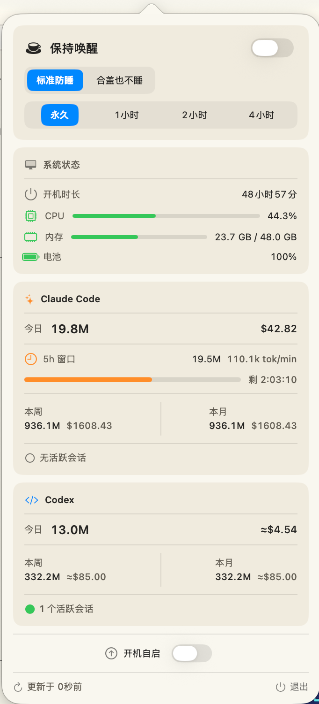

# KeepVibe

macOS 菜单栏工具，提供两大核心功能：

1. **保持唤醒**：通过 IOKit 电源断言防止 Mac 休眠，支持标准模式（阻止系统空闲休眠）和合盖模式（接通电源时合盖不休眠），可设置永久或定时（1/2/4 小时）。
2. **AI 用量统计**：扫描本地日志，统计 Claude Code（`~/.claude/projects/`）和 Codex（`~/.codex/sessions/`）的 token 用量与费用，按今日 / 本周 / 本月维度展示，并显示 Claude 的 5 小时滑动窗口进度。

## 截图



## 构建

```bash
swift build -c release
```

## 打包（本地）

```bash
./scripts/build-macos-app.sh
```

脚本会生成：
- `dist/KeepVibe-macos.zip`
- `dist/KeepVibe-macos.dmg`

## 运行

```bash
.build/release/KeepVibe
```

App 以菜单栏形式运行，不占用 Dock 位置（`NSApp.setActivationPolicy(.accessory)`）。

## 常见问题：KeepVibe.app 已损坏

如果启动提示“**KeepVibe.app 已损坏，无法打开。你应该将它移到废纸篓。**”，通常是 macOS 的 Gatekeeper 额外属性导致。

可按下面步骤处理（请按你实际路径替换）：

```bash
# 1) 如果是 dmg 下载文件，先清理 dmg 的 quarantine 属性
xattr -d com.apple.quarantine /path/to/KeepVibe-macos.dmg

# 2) 挂载后，清理 .app 的 quarantine 属性（推荐）
xattr -dr com.apple.quarantine /path/to/KeepVibe.app

# 3) 如果你是从 zip 解压得到的，也可以先清理 zip 再解压
xattr -d com.apple.quarantine /path/to/KeepVibe-macos.zip
```

处理后再执行：

```bash
open /path/to/KeepVibe.app
```

如果问题仍在，可先确认签名链路（仅用于本地自测验证）：

```bash
codesign --verify --deep --strict --verbose=4 /path/to/KeepVibe.app
spctl --assess --type execute --verbose=4 /path/to/KeepVibe.app
```

清理后再次解压/挂载并打开即可。  
另外建议优先下载带签名/公证的正式发布包（workflow 会在标签构建时对发布产物签名）。

## 功能点

- 菜单栏图标点击展开弹窗（SwiftUI + NSPopover）
- 防睡模式切换：standard / clamshell
- 定时防睡：到期自动停止
- 系统状态面板：CPU 占用、内存使用、电池电量、系统运行时间
- Claude Code 用量：今日/本周/本月 token 及费用，5 小时窗口进度条
- Codex 用量：今日/本周/本月 token 及近似费用
- 开机自动启动（写入 `~/Library/LaunchAgents` plist）
- 平台要求：macOS 14+，Swift 6
